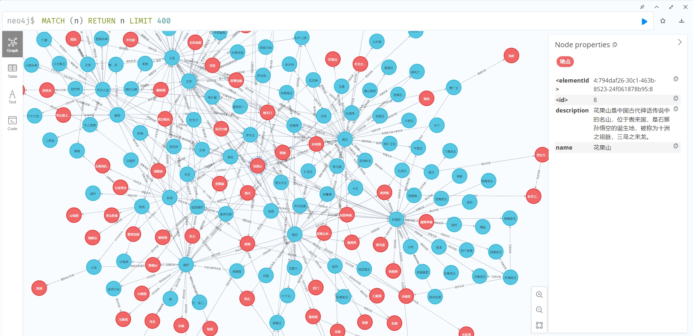
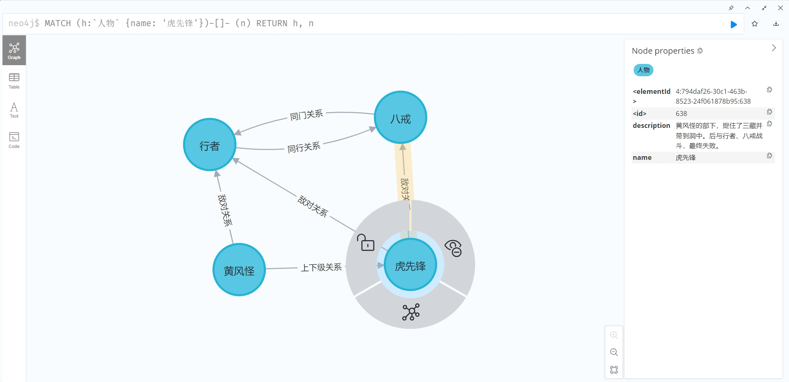

<div align="center">
# ZLAI-Graph

**使用大模型提取知识图谱**
</div>

> 项目介绍

**这个项目提取了《西游记》原著中的`人物/地点`的实体与其关系。** 实体关系提取框架使用了[ZLAI](https://zlai-llm.github.io/zlai-doc/#/)大模型使用了智谱AI的[GLM4](https://www.zhipuai.cn/)。

> 实体关系节点介绍

项目共提取了《西游记》原著`人物/地点`节点5017个，关系4213个。

<details>
    <summary>展开查看节点示例</summary>

| entity_name   | entity_type | entity_description                                                                  |
|---------------|-------------|-------------------------------------------------------------------------------------|
| 美猴王           | 人物          | 石猴被封的称号，因远虑而烦恼，决定离开猴群，云游海角，远涉天涯，寻找佛仙神圣三者，以求长生不老。                                    |
| 通背猿猴          | 人物          | 一个见识广博的猿猴，告诉美猴王有三等人不受阎王老子所管，鼓励美猴王去寻找佛仙神圣。                                           |
| 南赡部洲          | 地点          | 美猴王最终到达的地方，他在这里开始模仿人类的行为，寻找长生不老的方法。                                                 |
| 猴王            | 人物          | 一位访道学仙的弟子，来自东胜神洲傲来国花果山水帘洞。他遇见樵夫后，得到了灵台方寸山和斜月三星洞的指引，希望拜访须菩提祖师。他具有孝心，但自称飘洋过海多年寻找修行之道。 |
| 樵汉            | 人物          | 一位勤劳的樵夫，与神仙相邻，得到了神仙的教诲。他因家事劳苦，无法去修行，但指引猴王去灵台方寸山寻找神仙。                                |
| 须菩提祖师         | 人物          | 居住在灵台方寸山斜月三星洞的神仙，有许多徒弟在修行。他起初对猴王的来历持怀疑态度，但猴王坚称自己是从远方来寻道。                            |
| 东胜神洲傲来国花果山水帘洞 | 地点          | 猴王的家乡，位于远方，隔着两重大海和一座南赡部洲。                                                           |

</details>

<details>
    <summary>展开查看关系示例</summary>

| source | target | relationship | description                       | strength |
|--------|--------|--------------|-----------------------------------|----------|
| 增长天王   | 悟空     | 对立关系         | 增长天王带领天兵天将阻挡悟空进入南天门，显示他们之间存在对立关系。 | 6.5      |
| 美猴王    | 花果山水帘洞 | 居所关系         | 美猴王的居所是花果山水帘洞，他们之间是居住者与地点的关系。     | 8.0      |
| 增长天王   | 南天门    | 守卫关系         | 增长天王守卫南天门，显示他们之间存在守卫者与地点的关系。      | 7.0      |
| 秦广王    | 地府     | 管理关系         | 秦广王作为地府的阎王，管理着地府，他们之间存在管理者与地点的关系。 | 8.5      |

</details>

**关系示例**

> Neo4J展示

*全量节点*



*节点查询*

```cql
MATCH (h:`人物` {name: '虎先锋'})-[]- (n)
RETURN h, n
```

<details>
    <summary>展开查看节点示例</summary>
    
</details>

> 项目文件

```text
- data
    - entity.csv      # 实体信息，GLM4Flash提取结果
    - entity_v1.csv   # 实体信息，GLM4提取结果
    - relation.csv    # 关系信息，GLM4Flash提取结果
    - relation_v1.csv # 关系信息，GLM4提取结果
    - 西游记.md        # 原始文本
- notebook
    - graph.ipynb      # 知识图谱提取
    - neo4j.ipynb      # Neo4j可视化
```

> 问题

1. 输出的描述中有部分为英文。

> 讨论群

<center>

<h5>微信群</h5>
</center>

-----
